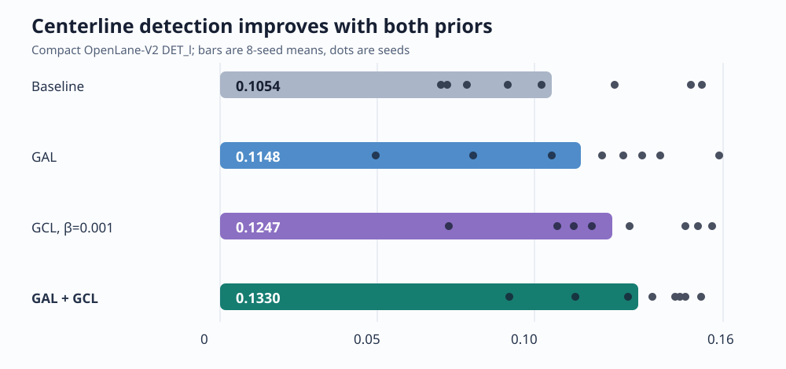
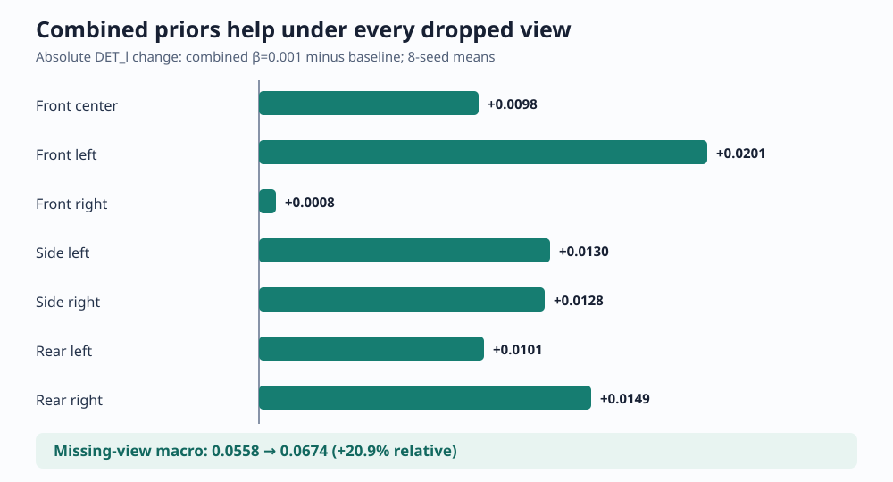
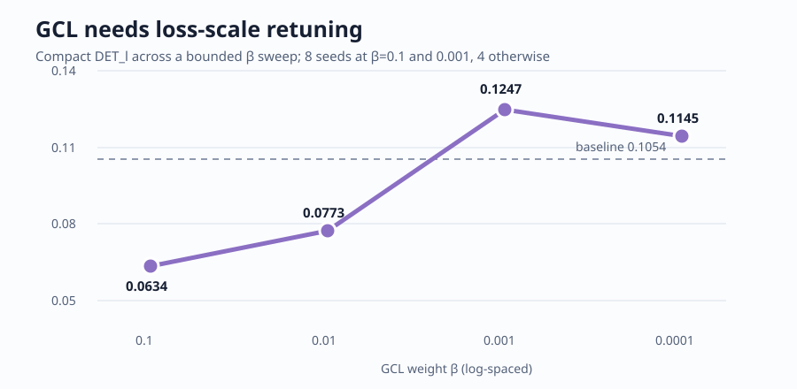
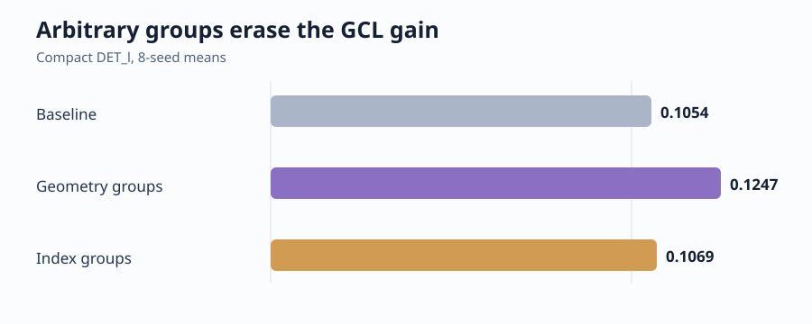
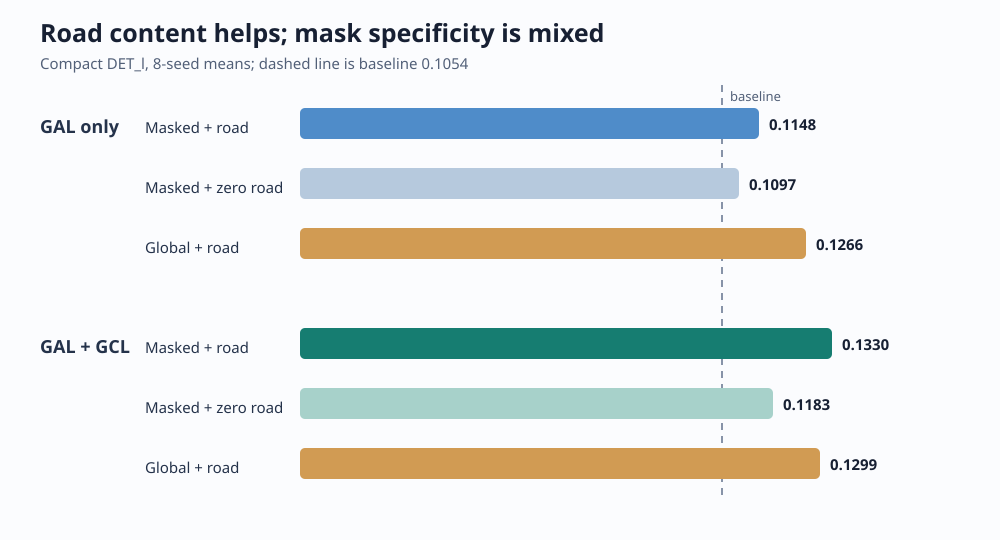

# HGeo-TopoMap: a bounded claim-by-claim reproduction

Autonomous-driving systems need a compact map of road centerlines, even though those centerlines are often not painted on the road. HGeo-TopoMap proposes two ways to make them easier to infer: show the detector an estimated road-area map, and encourage centerlines pointing in similar directions to have similar internal representations. This reproduction tested whether those ideas improve a matched detector and whether the improvement survives a missing camera.

## Verdict

**Partially reproduced.** On a compact public OpenLane-V2 split, the road-prior module (GAL) and a scale-adjusted orientation-consistency loss (GCL) each improved centerline detection, and their combination was best. The combined model also improved every missing-camera condition. This is directional rather than full-benchmark evidence: the disclosed GCL weight did not transfer, and GAL's spatial mask was not independently superior in its standalone control.

**How to read this figure:** longer bars mean better held-out centerline detection; dots show the eight seed results. The matched baseline scored 0.1054, GAL 0.1148, retuned GCL 0.1247, and both 0.1330. The paper's official full-set DET_l rises from 29.7 to 31.3; our Fréchet-AP scale is smaller and not numerically comparable, so the relevant agreement is the ordering and positive deltas.

## What was implemented

The experiment used the real OpenLane-V2 public sample: 64 frames from its two scenes, split temporally within each scene into 48 training and 16 validation frames. A compact TopoLogic-style detector decoded centerline queries from seven public ResNet-18 camera feature maps.

GAL used a public SegFormer Cityscapes segmenter to estimate road pixels, projected those pixels into bird's-eye coordinates with the supplied camera calibration, encoded occupancy and position, and applied the paper's distance mask `−D/k` with `k=0.1`. This substitutes for the paper's Mask2Former/Mapillary prior generator. GCL grouped matched centerlines into two straight orientations or a curved group and applied supervised contrastive consistency to their query embeddings. It does not recreate the paper's complete geometry-aware decoder.

Each variant trained for 1,200 steps. DET_l here is average precision over discrete Fréchet-distance thresholds. Eight independent seeds were pooled for every headline and control comparison.

## Separable and additive gains

| Variant | DET_l, mean ± population SD | Change from baseline | Assessment |
|---|---:|---:|---|
| Baseline | 0.1054 ± 0.0315 | — | matched control |
| GAL | 0.1148 ± 0.0330 | +0.0094 | aligned |
| GCL, β=0.001 | 0.1247 ± 0.0262 | +0.0193 | aligned after scaling |
| GAL + GCL | **0.1330 ± 0.0195** | **+0.0276** | aligned after scaling |

GAL and GCL therefore provide separable gains, while the combination exceeds GAL by 0.0183 and GCL by 0.0083. The combined relative improvement over baseline is 26.2%. Seed dispersion is substantial on only 16 validation frames, but the mean ordering matches the paper's ablation claim.

## Missing-camera robustness

Dropping one camera at evaluation lowers all scores, as expected. The combined model's macro average was 0.0674 versus 0.0558 for baseline, a 20.9% relative improvement, and all seven camera-specific differences were positive. This aligns with the paper's robustness direction, though it does not reproduce its exact rear-left +7.5% result because the split, detector, and metric scale differ.

## What the controls say

The paper's disclosed `β=0.1` reduced the compact model to 0.0634. A bounded sweep found 0.001 best at 0.1247; 0.0001 fell to 0.1145. Loss magnitudes therefore do not transfer unchanged from the undisclosed full implementation.

Replacing geometric orientation groups with arbitrary query-index groups produced 0.1069—essentially the 0.1054 baseline and well below geometry-grouped GCL. This negative control ties the gain to the intended orientation relation rather than to adding any contrastive objective.

Zeroing semantic road occupancy while retaining the GAL pathway reduced GAL from 0.1148 to 0.1097 and the combined model from 0.1330 to 0.1183, supporting a useful road-content signal. Yet global attention beat masked attention for GAL alone (0.1266 versus 0.1148); with GCL, masked attention was only slightly better (0.1330 versus 0.1299). Thus the explicit road prior contributes, but this setup does not isolate a robust advantage for the paper's particular GAL mask.

## Claim assessment and limits

| Claim | Paper | Observed | Assessment |
|---|---|---|---|
| GAL improves DET_l | +0.7 official points | +0.0094 compact AP | aligned |
| GCL improves DET_l | +0.9 official points | +0.0193 at β=0.001; negative at β=0.1 | partially aligned |
| Combined is best | 29.7 → 31.3 | 0.1054 → 0.1330 | aligned after scaling |
| Missing-view robustness improves | higher across dropped views | +20.9% macro; 7/7 views positive | aligned |

The principal limitations are the 64-frame sample, compact decoder, substituted segmenter, simplified GCL, and high seed variance. A full reproduction still needs the complete OpenLane-V2 train/validation sets, official TopoLogic evaluation, the authors' geometry-aware decoder, and their road-prior model.

All qualifying runs started after 2026-07-28T00:35:03.092Z on **Kubernetes**, using **NVIDIA RTX PRO 6000 Blackwell** GPUs. Runs allocated four GPUs each, with four concurrent runs for a peak of **16 GPUs**. The observed Kubernetes campaign elapsed **46m 32s (0.775613 wall hours)** through the final terminal log.

[Open the self-contained notebook in Molab](https://molab.marimo.io/github/alphaXiv/hgeo-topomap-d38d5225/blob/main/notebooks/hgeo_topomap_reproduction.py), inspect the [embedded tutorial notebook](../../notebooks/hgeo_topomap_reproduction.py), or see the [machine-readable aggregates](results.json).
